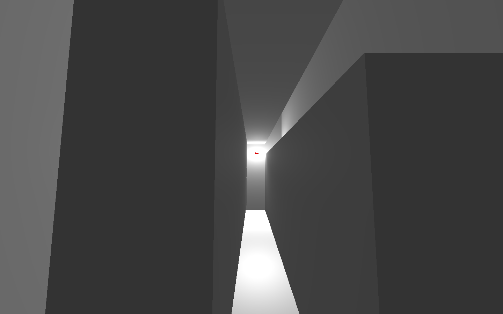
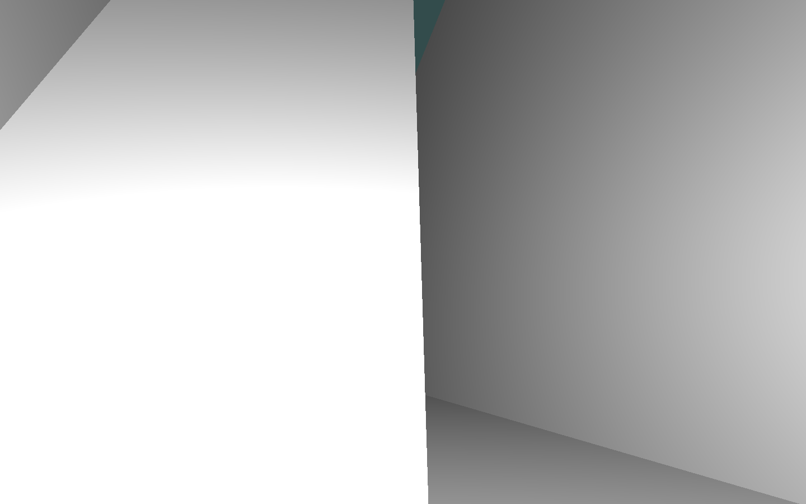

# CSCI 441 Project 1 - The Maze
The Maze is a fun 3D-Maze that the user can traverse in either a first person prespective or from a birds eye view that is built using C++ and OpenGL!

# Building
All of the following commands assume that you're in the `proj1` directory. You will need to run the following commands:

    $ mkdir build
    $ cd build
    $ cmake ..
    $ make

# Running the executable
To run the program first navigate to the `build` directory. Then run the following command:

    $ ./proj1

# Controls
* ## Movement
  * Move Forward: `up arrow`
  * Move Left: `left arrow`
  * Move Backward: `down arrow`
  * Move Right: `right arrow`
* ## Manipulation of Character
  * Rotate Around X-Axis: `I` and `U`
  * Rotate Around Y-Axis: `O` and `P`
  * Rotate Around Z-Axis: `[` and `]`
  * Move Character Along Y-Axis: `,` and `.`
  * Scale: `-` and `=`
* ## Camera
  * Switch Mode: `space`
  * Pan Camera (Bird's Eye View): `W`, `A`, `S`, and `D`
  * Look Around (First Person View): `mouse`
* ## Other
  * Quit: `escape` or `Q`

# Images

# Video
A video of the maze program in action can be found [here](https://www.youtube.com/watch?v=yoXPKvwuuR8&feature=youtu.be)!

# Contributers
* [Ethan Miller](https://github.com/EthanMiller2)
* [Alexander Pelaez](https://github.com/AlexPelaez)
* [Ryan Pallman](https://github.com/cookieman768)

# Licence
[MIT](LICENSE)
